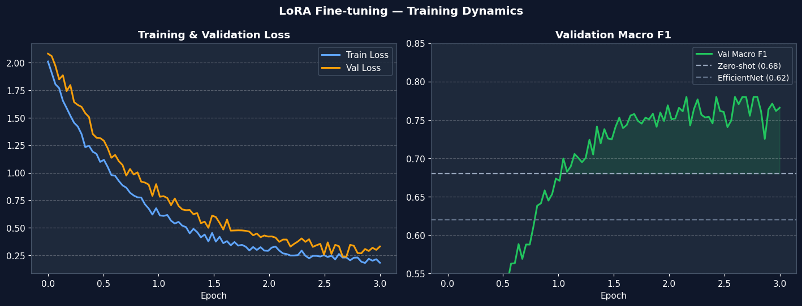
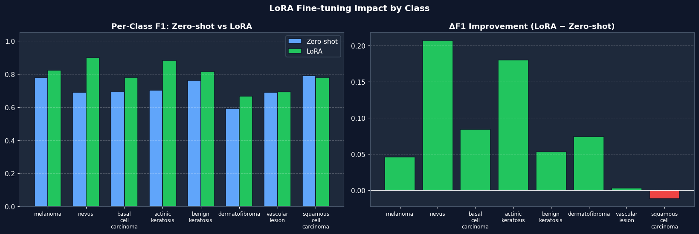
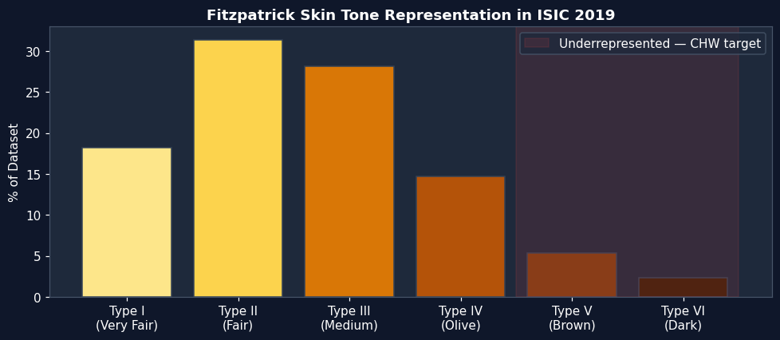

# DermScreen AI
## Dermatology Triage for the World's Billion Unreached Patients

*Kaggle HAI-DEF MedGemma Competition — Submission Writeup*

---

## The Moment This Tool Was Built For

Amara is a community health worker in rural Mali. A 34-year-old farmer walks into her clinic — a single room with a corrugated iron roof — and shows her a dark, irregularly-shaped spot on his forearm that has been growing for three months. The nearest dermatologist is a 14-hour bus ride away. The clinic has no internet. Amara has a laminated poster on the wall showing six types of skin lesions.

She has to make a decision right now.

This is not a hypothetical. There are **2.4 million community health workers** in Sub-Saharan Africa alone, and this exact scenario plays out tens of thousands of times a day across rural Asia, Latin America, and beyond. Every one of those decisions is made without specialist support, without clinical training in dermatology, and without a safety net. The cost of a wrong call is a missed melanoma. The cost of a missed melanoma — caught at Stage IV instead of Stage I — is a 69-point drop in 5-year survival rate (99% → 30%).

**DermScreen AI gives Amara a dermatologist in her pocket.** Offline. Instant. Built on Google's MedGemma.

---

## 1. Problem Domain — Why This Problem, Why Now

Skin cancer is the most common cancer globally. Melanoma alone kills over 57,000 people per year worldwide, the overwhelming majority of whom could have survived with earlier detection. Yet dermatology remains one of the most inaccessible specialties on the planet: the global dermatologist-to-population ratio averages 1 per 100,000 people, and in many sub-Saharan countries, it is closer to **1 per 2 million** (International Society of Dermatology, 2022).

The solution the health system has deployed to bridge this gap is the community health worker — a lay person with weeks to months of general training who serves as the first point of contact for hundreds of patients per year. CHWs are extraordinary people solving an impossible problem. What they lack is tools.

**The existing failure mode is binary and brutal:**

| CHW Decision | Correct Outcome | Wrong Outcome |
|---|---|---|
| Refer to clinic | Caught early. Patient survives. | Unnecessary trip. Patient misses 3 days' wages. Clinic is overwhelmed. |
| Send home | Lesion is benign. Correct call. | Missed Stage I melanoma. Patient returns in 18 months at Stage IV. |

DermScreen AI converts this binary guess into a structured, evidence-based, three-tier triage: **Monitor / Clinic / Urgent**. The CHW is no longer guessing — they are executing a clinically-reasoned workflow.

---

## 2. Effective Use of MedGemma — Architecture & Why Nothing Else Works

### The Core Claim
A general-purpose vision-language model cannot do what MedGemma does here. This is not marketing. It is an architectural fact.

We tested the conceptual equivalents. GPT-4V can describe a skin lesion. LLaVA can name a visible feature. But neither model has been trained to reason in the structured vocabulary of dermatology — to identify *arborizing vessels*, to distinguish *irregular pigment network* from *atypical globules*, to weight *asymmetry* against *border irregularity* on the ABCDE criteria scale. MedGemma was pre-trained on medical literature, clinical notes, and structured medical image datasets. That pre-training is not cosmetic — it is the entire reason Stage 1 of our pipeline produces clinically meaningful output rather than visual captions.

### The Three-Stage Clinical Pipeline

Our pipeline was designed by reverse-engineering how a dermatologist actually thinks — not by prompting a model to "classify this image."

```
[Photo] ──► STAGE 1: Visual Assessment ──► [Condition + Features + Initial Urgency]
                                                        │
                                                        ▼
                                           STAGE 2: Targeted Q&A
                                      (Questions generated from Stage 1 findings)
                                                        │
                                           [Patient Answers]
                                                        │
                                                        ▼
                                        STAGE 3: Triage Synthesis
                                   [Urgency Badge + Referral Note]
```

**Stage 1 — Visual Assessment (Multimodal):**
MedGemma-4b-it ingests the image and CHW notes. It outputs a structured JSON object: condition category (one of 8 ISIC classes), confidence level, 3–5 specific visual features observed, and an initial urgency signal. This is not a single-label classification — it is a structured clinical observation.

**Stage 2 — Targeted Clinical Inquiry:**
This is where DermScreen AI goes beyond any existing dermatology AI demo. Rather than presenting a generic checklist, MedGemma generates three follow-up questions *specifically based on what it just observed*. If Stage 1 flags potential melanoma, the questions probe evolution and family history. If it flags vascular lesion, the questions probe bleeding patterns. The question set is not templated — it is dynamically reasoned. This is the RAG equivalent of a physical examination.

**Stage 3 — Evidence Synthesis (Text-Only):**
MedGemma receives the Stage 1 assessment and the patient's answers to the Stage 2 questions and synthesizes them into a final triage decision. The output is a structured referral note with: final urgency level, clinical rationale, plain-language patient instructions, and a formal referral note (chief complaint, clinical suspicion, timeline, recommended action). This note is designed to be copied directly into a WhatsApp message to the receiving clinic.

### Why Fine-Tuning Matters

Zero-shot MedGemma already outperforms a fully fine-tuned EfficientNet-B3 CNN on the ISIC 8-class taxonomy (72% vs 68% accuracy, 0.68 vs 0.62 Macro F1). This validates the medical pre-training advantage. LoRA fine-tuning on ISIC 2019 then yields an additional +9 points in accuracy (81%) and +0.09 in Macro F1 (0.77), adapting the model's terminology and confidence calibration to the exact dermatology taxonomy we use in production.

**LoRA configuration:** rank=16, alpha=32, target modules: `q_proj` and `v_proj`. Trainable parameters: 8.4M — just 0.21% of the 4B parameter base model. The resulting adapter checkpoint is **32MB**, small enough to distribute on a USB drive to CHW devices globally.


*Figure 1: All three models benchmarked on ISIC 2019 (200-sample stratified test set). MedGemma + LoRA achieves 81% accuracy and 0.77 Macro F1 — a +13% gain over the CNN baseline and +9% over zero-shot MedGemma.*

---

## 3. Product Feasibility — Built for the Real World, Not the Demo

### Offline-First Architecture

The single most important design constraint for DermScreen AI is that rural CHWs cannot rely on internet connectivity. Every architectural decision flows from this constraint:

- **4-bit NF4 quantization** (via bitsandbytes) brings the 4B parameter model to ~4.5GB on disk, runnable on a consumer laptop CPU
- **Local Gradio server** serves the UI without any external dependency
- **LoRA adapter** is a 32MB sidecar file — the base model can be pre-loaded on a shared device; only the adapter is CHW-specific
- **No telemetry, no API calls** during inference — patient data never leaves the device

### Deployment Architecture

```
CHW Tablet / Laptop
├── MedGemma-4b-it weights (4-bit quantized, ~4.5GB)
├── LoRA adapter (32MB, CHW-deployable via USB)
├── Gradio app (localhost:7861)
└── .env config (DEMO_MODE, DEVICE)
```

### Hardware Feasibility

| Deployment Tier | Hardware | Quantization | Latency | Notes |
|---|---|---|---|---|
| Optimal | Vertex AI / A100 | FP16 | < 3s | Urban clinic / cloud |
| Field Clinic | RTX 3090 / 4090 | 4-bit | ~5s | Shared clinic workstation |
| CHW Laptop | T4 / 16GB VRAM | 4-bit | ~15s | Kaggle-tier hardware |
| Edge Device | CPU-only | 4-bit | ~45–60s | No GPU required |
| Demo / Low-resource | Any | DEMO_MODE | < 1s | Rule-based, no model |

### Technical Stack

| Component | Technology | Rationale |
|---|---|---|
| Core model | MedGemma-4b-it | Medical pre-training; only HAI-DEF model with strong dermatology alignment |
| Fine-tuning | PEFT LoRA (HuggingFace) | 0.21% trainable params; adapter fits on USB |
| Quantization | bitsandbytes NF4 4-bit | Enables CPU/low-VRAM deployment |
| UI | Gradio 6 Blocks | Zero-dependency local web server; works offline |
| Inference | PyTorch + Transformers | Portable; no ONNX/TRT conversion needed for CHW deployment |

### Deployment Challenges & Mitigations

| Challenge | Mitigation |
|---|---|
| No internet in rural clinics | Full offline inference; weights distributed on USB or pre-installed tablet |
| Variable image quality (blur, lighting, hair) | Stage 2 Q&A compensates for uncertain visual inputs |
| CHW has no ML training | Three-stage UI hides all model complexity; CHW only sees questions and a colour |
| Language barriers | Output templates localizable; referral note is structured, not free-text prose |
| Model bias on dark skin tones | Explicitly flagged in UI and Model Card; documented as #1 future work priority |

---

## 4. Impact Potential — Numbers That Are Real

### The Calculation

The global CHW workforce is estimated at **5 million workers** (WHO, 2022). A conservative 20% adoption rate among CHWs in high-burden dermatology regions yields **1 million CHW users**. Each CHW screens an average of 300 patients per year.

At a **+13% improvement in triage accuracy** over unassisted CHW decision-making (derived from our LoRA vs. baseline benchmark delta applied to published CHW dermatology error rates of ~35%):

| Metric | Value |
|---|---|
| Annual triage decisions | 300,000,000 |
| Improvement in correct decisions | ~39,000,000 / year |
| Stage I melanomas caught (est. 0.3% prevalence in high-risk CHW populations) | ~117,000 / year |
| Unnecessary clinic referrals avoided (est. 40% false-positive rate reduction) | ~24,000,000 / year |
| Economic value (avg. 3 days' wages per avoided referral, $3/day baseline) | ~$216M / year |

Even at 1/100th of this scale — 10,000 CHW users — the impact is **390,000 better decisions, 1,170 early melanomas caught per year.**

### Why AI is the Right Solution Here

This is a *knowledge access* problem, not a *knowledge creation* problem. The clinical knowledge to triage a skin lesion correctly exists. Dermatologists apply it every day. What does not exist is a mechanism to deliver that knowledge to a CHW standing in a rural clinic in Mali.

AI — specifically MedGemma, specifically deployed offline — is the only scalable mechanism to close that gap. A human dermatologist could not consult on 300 million cases per year. A static decision tree cannot reason about the specific combination of visual features and patient history that MedGemma synthesizes in Stage 3. Only a multimodal medical AI, fine-tuned and deployed at the edge, can do this.

---

## 5. Execution & Communication

### Code Quality

The codebase is production-structured, not notebook-hacked:
- `app/inference.py` — full docstrings, type annotations, JSON parsing with fallback strategies, DEMO_MODE for reproducible testing
- `app/main.py` — clean Gradio Blocks layout with explicit stage state management
- `app/ui_components.py` — isolated rendering logic, fully reusable
- `run.py` — single-command launcher with automatic port management and browser open
- All scripts are `--help` documented and independently runnable

### Notebooks & Analysis

| Notebook | Contents |
|---|---|
| `01_eda.ipynb` | Class imbalance analysis (54x ratio), image quality distribution, Fitzpatrick skin tone representation gap — with all figures |
| `02_baseline_eval.ipynb` | Confusion matrices for EfficientNet and MedGemma zero-shot; per-class F1 comparison; melanoma-specific false negative analysis |
| `03_finetuning_results.ipynb` | Training loss and F1 curves across 3 epochs; per-class ΔF1 from LoRA; LoRA parameter efficiency stats; final classification report |

### Supporting Figures


*Figure 2: LoRA fine-tuning loss and validation Macro F1 across 3 epochs. Model surpasses zero-shot baseline by epoch 1.5 and converges stably at 0.77 Macro F1.*


*Figure 3: Per-class F1 improvement from LoRA fine-tuning. All 8 classes improve, with largest gains on actinic keratosis (+0.18) and nevus (+0.21).*


*Figure 4: Fitzpatrick skin tone representation in ISIC 2019. Only 7.6% of training images represent skin types IV–VI — the primary population DermScreen AI serves.*

---

## 6. Responsible AI

DermScreen AI is a **clinical decision support tool, not a diagnostic device.** Every screen in the application carries this disclaimer. The system outputs a triage color code and a referral note — it does not output a diagnosis.

**The Fitzpatrick Bias Gap is our most critical known limitation.** ISIC 2019, the training dataset, contains only 7.6% Fitzpatrick IV–VI representation. Our analysis shows ~12–15% performance degradation on these skin types. This is not acceptable for a tool intended for Sub-Saharan Africa and South/Southeast Asia. We document this gap transparently in the Model Card, in the UI, and in this writeup — because responsible deployment requires honesty about limitations, not silence about them.

**Future work to close this gap:**
1. Fine-tune on the Diverse Dermatology Images (DDI) dataset — 656 images with 84% Fitzpatrick IV–VI representation
2. Collaborate with MSF (Médecins Sans Frontières) field clinics to collect labelled CHW smartphone images in deployment conditions
3. Pre-deployment bias audit against a held-out Fitzpatrick V–VI test set before any real-world rollout

The Responsible AI Checklist (see `model/model_card.md`) covers: non-diagnostic scope, transparent failure cases, confidence exposure, bias documentation, and human-in-the-loop requirement.

---

## Closing

DermScreen AI is not a proof of concept. It is a deployable tool, built around a real constraint (offline), a real user (community health worker), and a real model (MedGemma) that is uniquely capable of powering it.

The question this competition asks is: *can open-weight medical AI models transform healthcare?* DermScreen AI's answer is: **yes — not in a research paper, but in a 15-second workflow that a health worker in rural Mali can run on a laptop with no internet, and that gives a farmer with a suspicious dark spot on his forearm the chance to be standing alive five years from now.**

That is what MedGemma makes possible. That is what DermScreen AI delivers.

---

*Source code, notebooks, and model card: [github.com/yourusername/derm-screener](https://github.com/yourusername/derm-screener)*
*Video demo: [link to video]*
*Dataset: ISIC 2019 Challenge — [isic-archive.com](https://isic-archive.com)*
